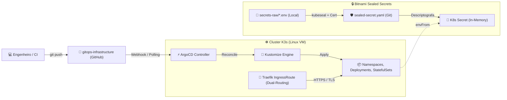

# Repositório Central de Infraestrutura GitOps & Automação CD

Repositório central de procedimentos, scripts automatizados, blueprints K8s e documentações de arquitetura para provisionamento de ambientes **GitOps com k3s, Traefik, ArgoCD, Bitnami Sealed Secrets, Firewall UFW, Let's Encrypt TLS e PostgreSQL Segregado**.

---

## 🏛️ Fluxo Operacional GitOps & CD



---

## Estrutura do Repositório

```text
gitops-infrastructure/
├── README.md                           # Este guia principal
├── scripts/                            # Scripts executáveis de provisionamento e operação
│   ├── 01-bootstrap-vm.sh              # Instala k3s, kubectl, kubeseal e ferramentas base
│   ├── 02-setup-argocd.sh              # Instala ArgoCD + IngressRoute no Traefik
│   ├── 03-setup-sealed-secrets.sh      # Instala Bitnami Sealed Secrets Controller
│   ├── 04-configure-firewall.sh        # Aplica políticas de firewall UFW (Zero Trust)
│   ├── 05-add-private-repo-to-argocd.sh# Cadastra repositórios privados e credenciais GHCR no ArgoCD
│   ├── 06-encrypt-secrets-vault.sh     # Criptografa variáveis .env gerando SealedSecrets
│   ├── 07-deploy-homolog.sh            # Aplica applications de Homologação/Dev no ArgoCD
│   ├── 08-deploy-prod.sh               # Aplica applications de Produção no ArgoCD
│   ├── 09-setup-tls-letsencrypt.sh     # Configura SSL automático Let's Encrypt no Traefik
│   └── 10-backup-postgres-database.sh  # Automação de backup do PostgreSQL com compressão e retenção
├── docs/                               # Documentação detalhada de arquitetura e operação
│   ├── 01-visao-geral-arquitetura.md   # Arquitetura GitOps e fluxo de dados
│   ├── 02-mapeamento-hosts-dns.md      # Mapeamento de domínios e DNS
│   ├── 03-gerenciamento-segredos.md    # Uso do Sealed Secrets e ConfigMaps
│   ├── 04-reorganizacao-ci-github.md   # Pipelines do GitHub Actions
│   ├── 05-guia-replicacao-do-zero.md   # Roteiro completo para subir uma VM limpa
│   ├── 06-adicionando-novos-projetos.md# Como adicionar novos apps no cluster
│   ├── 07-padrao-repositorio-centralizado-k8s.md # Padrão sem K8s no repo da aplicação
│   ├── 08-ambientes-dev-e-prod.md      # Separação multiambiente (Dev vs Prod)
│   ├── 09-estrategia-de-backup.md      # Guia de backup/restauração do Postgres e PVCs
│   ├── 10-dual-routing-sslip-e-dns-temporario.md # Padrão de Dual-Routing (sslip.io + Let's Encrypt)
│   └── 11-banco-de-dados-k8s-vs-cloud-sql.md # Matriz de decisão Postgres K8s vs Cloud SQL
├── secrets-raw/                        # Gabaritos locais de variáveis sensíveis (ignorado no Git)
│   ├── dev-postgres.env.example
│   └── prod-postgres.env.example
├── apps/                               # CENTRAL DE MANIFESTOS K8S DE TODAS AS APPS
│   ├── postgres/                       # Blueprint PostgreSQL 16 (StatefulSet + PVC SSD)
│   │   ├── base/
│   │   └── overlays/
│   └── eos/                            # Aplicação exemplo
│       ├── base/
│       └── overlays/
└── argocd-apps/                        # Manifestos de Applications do ArgoCD
    ├── eos-dev-application.yaml
    └── eos-prod-application.yaml
```

---

## Como Provisionar uma VM do Zero (Passo a Passo)

```bash
# 1. Clonar repositório
git clone https://github.com/alvaroico/gitops-infrastructure.git
cd gitops-infrastructure

# 2. Executar provisionamento sequencial
./scripts/01-bootstrap-vm.sh
./scripts/02-setup-argocd.sh
./scripts/03-setup-sealed-secrets.sh
./scripts/04-configure-firewall.sh

# 3. Cadastrar credenciais Git e GHCR
export GITHUB_TOKEN="ghp_seu_token"
./scripts/05-add-private-repo-to-argocd.sh

# 4. Encriptar segredos e fazer deploy
./scripts/06-encrypt-secrets-vault.sh postgres dev
./scripts/07-deploy-homolog.sh

# 5. Ativar HTTPS com Let's Encrypt
./scripts/09-setup-tls-letsencrypt.sh contato@empresa.com.br
```

Consulte os guias completos em [`docs/`](docs/) para detalhes adicionais.
