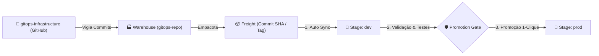

# Guia de Operação Kargo (Next-Gen GitOps & Multi-Stage Promotion)

O **Kargo** é a camada de controle de entrega contínua que orquestra a promoção controlada de versões entre ambientes (**Dev** $\rightarrow$ **Prod**), eliminando a necessidade de scripts manuais de CI/CD para atualização de tags no Git.

---

## 🏛️ Fluxo de Promoção com Kargo



---

## Estrutura Declarativa do Kargo

Os manifestos estão localizados no diretório [`kargo/`](../kargo/):

* [`kargo/project.yaml`](../kargo/project.yaml): Define o projeto lógico `eos-platform`.
* [`kargo/warehouse.yaml`](../kargo/warehouse.yaml): Vigia o repositório Git e gera os Freights.
* [`kargo/stages/eos-pipeline.yaml`](../kargo/stages/eos-pipeline.yaml): Esteira de promoção da aplicação EOS com barreira de segurança entre Dev e Prod.
* [`kargo/stages/postgres-pipeline.yaml`](../kargo/stages/postgres-pipeline.yaml): Esteira de promoção do PostgreSQL segregado.
* [`kargo/ingressroute-kargo.yaml`](../kargo/ingressroute-kargo.yaml): Exposição HTTPS segura no Traefik Ingress.

---

## Como Operar no Dia a Dia

### 1. Instalar o Kargo no Cluster

```bash
./scripts/02-setup-kargo.sh
```

### 2. Cadastrar Token do GitHub

```bash
export GITHUB_TOKEN="ghp_seu_token_aqui"
./scripts/05-add-private-repo-to-kargo.sh
```

### 3. Aplicar os Pipelines de Estágios

```bash
./scripts/07-deploy-kargo-pipelines.sh
```

### 4. Promover Versões pelo Terminal

```bash
# Promover o frete mais recente para Dev
./scripts/08-promote-kargo-stage.sh dev

# Promover para Produção
./scripts/08-promote-kargo-stage.sh prod
```

### 5. Acesso ao Dashboard Web

* **URL**: `https://kargo.alvaroico-teste.com.br` (ou via port-forward `kubectl port-forward svc/kargo-api 8080:443 -n kargo`)
* **Usuário**: `admin`
* **Senha**: `admin123!`
